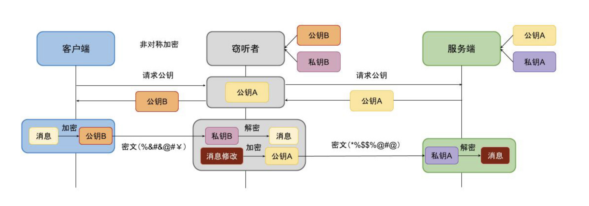

由于http协议的不安全性，在传输敏感数据时需要对数据进行加密处理。如果采用对称加密，使用相同的密钥对数据进行加密，密钥的保存又是一个问题。如果放到前端中存放，无论如何防护，都有被破解泄漏的可能性，而一旦泄漏，前端则需要升级新版本才能更新密钥，还需对于未升级的老版本做兼容性处理。

如果采用非对称加密，客户端每次去请求这次通信的公钥，后续的通讯内容通过这个公钥进行加密发送到服务端，服务端用自己的私钥进行解密获取内容。响应内容也通过私钥加密发送到客户端，客户端用公钥解密。

该方案不会在客户端中存放密钥，降低了密钥泄漏的风险，但非对称加密的性能损耗较高，所以整个通信过程中会先通过非对称加密和服务器交换一个密钥。后续通过该密钥进行对称加密通信。

但是非对称加密通信通过中间人攻击即可完全获取通信内容。

中间人通过截获客户端的请求，模拟新的请求向服务器请求公钥，获取到真实的公钥后，自身生成新的公钥-私钥对，将自身的公钥发送给客户端，由此通过自身的私钥解析客户端发送的内容，并将内容用真实的公钥加密后发送给服务端，并用公钥解析出服务端返回的内容。

为了验证服务器的身份，防止中间人攻击，CA证书由此诞生。

### 自签证书

不用花钱！！

### 交叉认证

### 不同级别的ca证书

### CA证书的认证过程

### 不靠谱的CA机构

### HTTPS的中间人攻击

### Android校验CA证书

证书锁定（SSL pinning）？