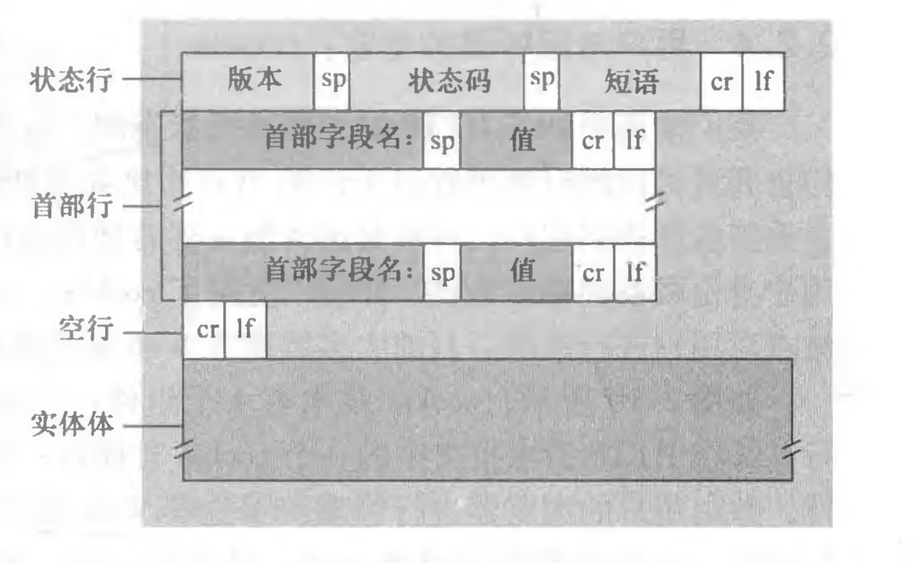
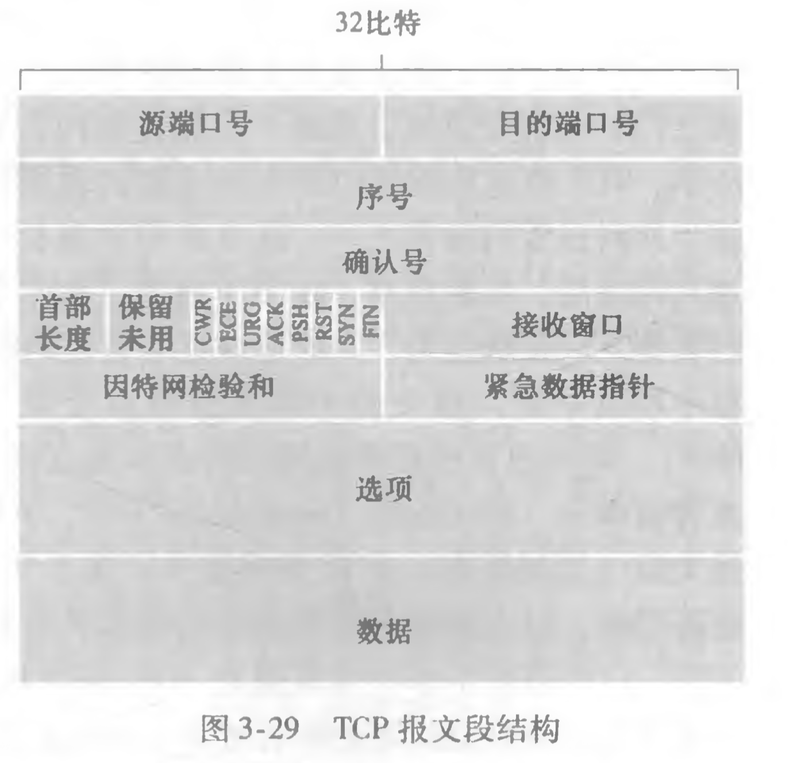
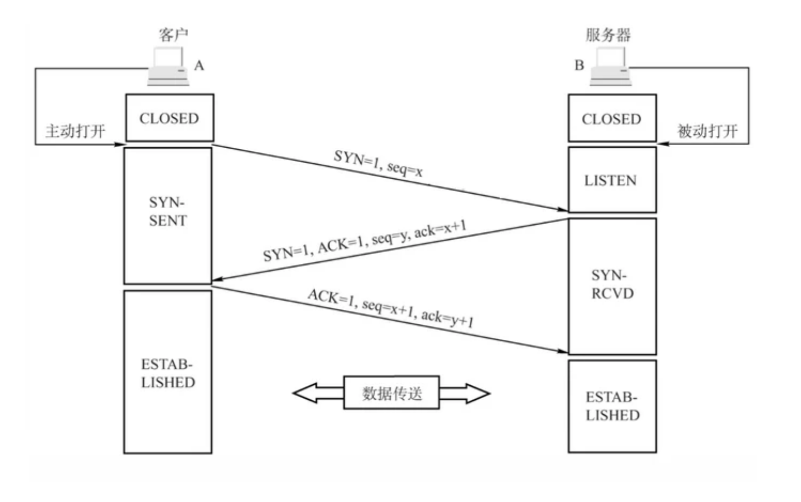
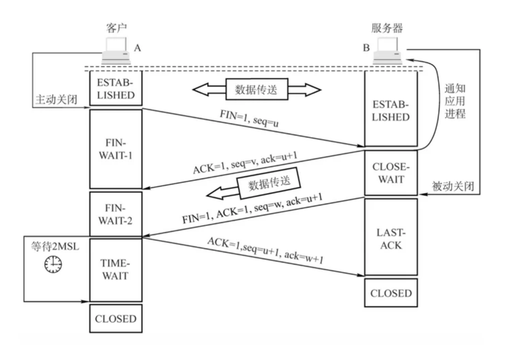
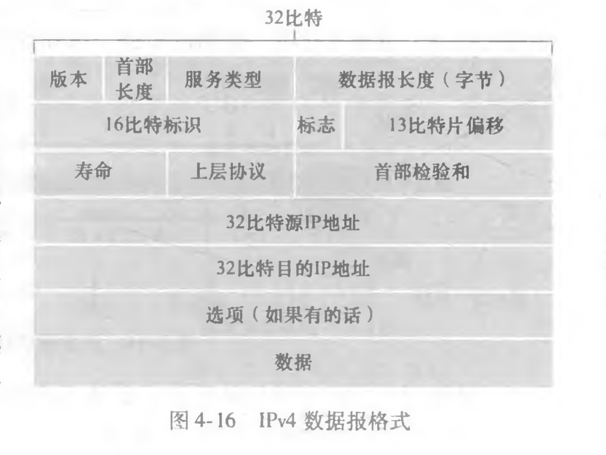

- [4. 子网掩码及网络划分]
- [5. ARP/RARP协议]
- [6. 路由选择协议]
- [7. TCP/IP协议]
- [10. NAT协议]
- - UPnP
- WebSocket
- VPN
- Traceroute
- OKHttp运行原理
- 宽带认证
- 多播


## 网络层次模型

OSI模型由国际标准化组织(ISO)提出，经过互联网的发展，目前大多采用五层模型或TCP/IP四层模型。层次模型总的设计理念为下层为上层服务。


1. 应用层

   应用程序实现的协议，包括常见的HTTP、FTP、SMTP（邮件传输协议）等。位于应用层的信息分组称为报文文 (message)。

2. 运输层

   接收上一层的数据，对大数据进行分割。包含了TCP和UDP协议，TCP保证了数据的可靠交付。运

   输层的分组称为报文段 (segment) 。

3. 网络层

   这层对端到端的包传输进行定义，它定义了能够标识所有结点的逻辑地址，还定义了路由实现的方式和学习的方式。为了适应最大传输单元长度小于包长度的传输介质，网络层还定义了如何将一个包分解成更小的包的分段方法。示例：IP，IPX等。在这一层，数据的单位称为数据包 (packet)。

4. 链路层

   定义了互联网络的两个设备之间传输数据的规范，并提供了顺序控制、差错检测和恢复。在这一层，数据的单位称为帧(frame)

5. 物理层

   实际的传输介质，例如，双绞铜线、单模光纤。

OSI参考模型相比5层模型多了表示层和会话层。

- 表示层

  使通信的应用程序能够解释交换数据的含义。这些服务包括数据压缩和数据 加密(它们是自解释的)以及数据描述(这使得应用程序不必担心在各台计算机中表示/ 存储的内部格式不同的问题)

- 会话层

  提供了数据交换的定界和同步功能，包括了建立检查点和恢复方案的方法


## 应用层协议

### HTTP

HTTP定义了通讯报文的结构与交换报文的方式，并使用TCP作为它的支撑运输协议。

#### 连接过程

1. 当发起连接时，客户端会先与服务端建立一个TCP连接。
2. 当连接建立成功后，客户端就会通过该TCP连接向服务端发送HTTP请求报文（HTTP报文会随着TCP的第三次握手一并发送）。
3. 服务端当从对应的TCP连接中获取到HTTP请求报文后，经过处理后返回HTTP相应报文。
4. 客户端接收到响应报文，做出相应动作。

在整个过程中，HTTP不需要关注数据丢失恢复等细节，因为数据丢失和乱序故障中恢复是在TCP中进行处理，对于HTTP只需关注自身对请求参数处理后返回响应即可。

当客户端连续快速发起两次或多次完全相同的请求，HTTP服务器不会因为之前发送过了一次响应结果而导致后续的结果有所不同，因为HTTP是一个**无状态协议**，不会去存储客户端的任何信息。

#### 连接模式

HTTP在其默认方式下使用持续连接，但也能配置成使用非持续连接。

如果在一个HTML中包含大量的图片等需二次请求的内容资源，如果使用非持续连接，在客户和服务器中都要分配TCP的缓冲区和保持TCP变量, 这给Web服务器带来了严重的负担。

> 持续连接(persistent connection) ：使用同一个TCP连接发送多个报文，当超过一定时间没有发送报文则关闭连接
>
> 非持续连接(non-persistent connection)：每发一个报文就新建一个TCP连接。


#### HTTP报文格式

HTTP请求报文格式如下：


```
GET /somedir/page.html HTTP/1.1 
Host: www.someschool.edu
Connection: close 
User-agent: Mozilla/5.0 
Accept-language: fr
```


HTTP请求报文的第一行叫作**请求行**(request line)，其后继的行叫作**请求头部**(header line)，在最后还有**请求体**。请求头有3个字段:**方法**、**URL**和**HTTP版本**。

##### 请求行

其中方法包含以下几种：

- GET: 通常用于获取资源，没有body

- POST: 增加或修改资源，有body

- PUT：修改资源，有body，*应用时大多被POST取代*

- DELETE：删除资源，没有body

- HEAD: 与GET基本相同，区别为服务器返回内容时是不会返回body，一个应用场景：下载前获取文件的大小、是否支持断点续传


而目前HTTP版本主流的是HTTP/2 在 HTTP/1.1，其中HTTP/2为2005年发布。

HTTP/2 在 HTTP/1.1 有几处基本的不同：

- HTTP/2 是二进制协议而不是文本协议。不再可读，也不可无障碍的手动创建，改善的优化技术现在可被实施。
- 这是一个复用协议。并行的请求能在同一个链接中处理，移除了 HTTP/1.x 中顺序和阻塞的约束。
- 压缩了 headers。因为 headers 在一系列请求中常常是相似的，其移除了重复和传输重复数据的成本。
- 其允许服务器在客户端缓存中填充数据，通过一个叫服务器推送的机制来提前请求。

> https://developer.mozilla.org/zh-CN/docs/Web/HTTP/Basics_of_HTTP/Evolution_of_HTTP

##### 请求头部

请求头部用来说明服务器要使用的附加信息：

- Host: 服务器的主机地址。

  因为访问时是通过DNS服务器解析出服务器的ip地址后，通过ip进行访问，当这个ip地址所对应的服务器下部署了多个域名的网站，服务器将通过Host传来的地址确定对应的具体网址。

- Connection:默认为keep-alive，即TCP连接默认不关闭，可以被多个请求复用，一段时间没有活动则关闭连接（规范的做法是，客户端在最后一个请求时，发送`Connection: close`，明确要求服务器关闭TCP连接）

- Content-Type/Content-Length : 内容的类型和长度

  - text/html：html文本
  - application/x-www-form-urlencoded：普通表单（纯文字表单）
  - multipart/form-data:多部分形式，包含二进制的内容
  - Application/json
  - Image/jpeg

- Transfer-Encoding: 分块传输，Content-Length不可用，传输结束时内容为0

- Location:重定向的位置

- User-Agent:让服务器识别设备类型

- Range/Accept-Range：使用断点续传/是否支持断点续传

- Accept:客户端能接受的数据类型

- Accept-Charset：客户端能接受的字符集

- Accept-Encoding:客户端能接受的压缩编码类型，如gzip

- Content-Encoding：传输内容的压缩类型

##### 请求体

请求报文最下边为请求体，可为空，是这次请求所附加的额外信息，在POST请求中，存放的是请求参数。


响应报文如下：



```
HTTP/1.1 200 OK
Connection: close
Date: Tue, 18 Aug 2015 15:44:04 GMT
Server: Apache/2.2.3 (CentOS)
Last-Modified: Tuer 18 Aug 2015 15:11:03 GMT Content-Length: 6821
Content-Type: text/html
(data data data data data •••)

```

响应Code:

- 1xx: 临时性消息 场景：先发个消息去服务器确认是否支持http2.0
- 2xx: 成功 *很多不规范的使用，将所有错误都归为200*
  - 201: 创建用户成功
- 3xx: 重定向
  - 304:内容没有改变
- 4xx: 客户端错误
- 5xx: 服务器错误


短语则是该Code的简要描述，比如200 0K，301 Moved Permanently，400 Bad Request，404 Not Found


cookie：

Server在响应报文中添加Set-cookie:xxx，浏览器自动保存该Cookie，并在下一次对同一域名的请求报文中添加Cookie：xxx。


链路层交换机实现了第一层和第二层;路由 器实现了第一层到第三层


节点时延的类型

- 处理时延(nodal processing delay) ：解析包数据，判断下一跳路由、差错判断的处理时间（微秒或更低的数量级）
- 排队时延(queuing delay)：链路阻塞，等待传输 （毫秒到微秒量级）
- 传输时延 (transmission delay)：路由会在完整接收全部分组后才会进行下一跳的转发，也就是当路由接收到第一个分组开始直到完整的分组接受完成所需的时间。取决于链路的速率和包的大小。（毫秒到微秒量级）
- 传播时延(propagation delay)：包在链路上传输的所需的时间，取决于链路上的最大传输速度（毫秒量级）


运输层协议提供

1. 可靠数据传输

2. 吞吐量：确保最低速率（并没有提供）

3. 定时（并没有提供）

4. 安全性：安全套接字层(Secure Sockets Layer, SSL)

   用SSL加强后的TCP不仅能够做 传统的TCP所能做的一切，而且提供了关键的进程到进程的安全性服务，包括加密、数 据完整性和端点鉴别，SSL不是与TCP和 UDP在相同层次上的第三种因特网 运输协议，而是一种对TCP的加强，这种强化是在应用层上实现的


TCP服务模型

- 面向连接
- 可靠的数据传送


DNS

1. 客户端发起DNS域名查询
2. 查询操作系统中的Hosts文件
3. 查询本地DNS服务器，一般为公司、学校、运营商搭建的就近服务器。
4. 本地DNS服务器向根DNS服务器发送查询请求，根DNS服务器判断查询域名所属哪一个顶级域名DNS服务器，向本地DNS服务器返回顶级DNS服务器的ip地址，**本地DNS服务器缓存该顶级域名服务器的ip地址**
5. 本地DNS服务器继续向顶级域名DNS服务器查询被查询域名所属的域名服务器，将下一级的域名服务器的ip返回本地服务器，**同样缓存返回的域名服务器对应的ip地址**
6. 一级一级查询直到查询到对应ip返回给本地DNS服务器
7. 本地服务器将查询到的ip回应给客户端
8. 再次请求相同域名时，从底向上(存疑)判断对应域名服务器的是否有缓存


CDN 内容分发网络

1. 客户端请求目标源站如 iqiyi.com
2. 服务端返回对应的资源url：video.iyiqi.com
3. 客户端通过DNS查询video.iyiqi.com所对应的ip地址，此时网站的权威DNS服务器返回所使用的CDN服务商的域名：xxx.cdnserver.com
4. 此时客户端的本地DNS服务器去查询该域名的ip地址，此时CDN运营商的DNS调度系统根据客户端的LDNS的出口ip地址或通过地域就近选择、或通过其他算法选择较优的CDN缓存服务器ip返回给客户端
5. 客户端拿到缓存服务器IP后请求资源文件
   - 缓存服务器命中需求文件：直接返回
   - 未命中资源：向源站拉取资源

DNS 缓存时效问题会对实际访问速度进行错误的判断。

部分用户配置的Local DNS服务器地址为较远的公共DNS服务器，使用Local DNS ip进行判断是也会可能出现跨区域调度的情况。

### 运输层

运输层协议是在端系统中而不是在路由器中实现的，网络路由器仅作用于该数据报的网络层字段。将应用层的消息封装为运输层报文，视情况进行分组。

- 网络层提供了**主机**之间的逻辑 通信，

- 运输层为运行在不同主机上的**进程**之间提供了逻辑通信


UDP

- 无须连接建立：不需要握手，传输时延低

- 无连接状态：不需要在端系统中维护连接状态，包括接收和发送缓存、 拥塞控制参数以及序号与确认号的参数，节省服务端开销

- **分组首部开销小**：每个TCP报文段都有20字节的首部开销，而UDP仅有8字节

  的开销。

UDP通过校验位也拥有差错判断的能力。


单行可靠传输流程

1. 发送方发送数据分组后，需要等待与该分组的序号相等的ACK回应，并启动一个超时计时器
2. 1. 接收方收到分组后，判断数据无差错，返回与接收分组序号相等的ACK
   2. 如果数据有差错，丢弃该分组，返回上一个接收到的分组序号ack
3. 1. 发送方接收到ACK，如果与发送序号相等，则发送下一个分组
   2. 如果序号不相等，则重新发送分组，刷新超时计时器
   3. 如果长时间未收到ACK，触发超时，也重新发送分组

滑动窗口（回退N步）：

1. 发送方将数据分成若干个组，依次发送窗口大小的分组如N个，此时等待接收方返回ACK

2. 接收方按序确认收到的分组，如收到乱序的分组，则抛弃分组，返回一个上次确认的序号的ACK
3. 如果接收方收到了重复的分组，可能是上次这个分组的ACK丢失，则重新发送ACK
4. 发送方根据返回的ACK向后滑动窗口，将新加入窗口的分组发送。如果收到了已经确认过的序号的ACK，则重发窗口内全部分组。

此方案对接收方没有缓存要求，遇到乱序的分组直接抛弃，但也带来了当窗口长度和带宽时延积都很大时，有一个分组丢失则需要全部重传的性能问题。

滑动窗口（选择重传）：

与回退N步的区别在于，发送方为每个分组都会启动一个定时器，当接收方返回该分组的ACK后，关闭计时器。当某个分组丢失时，接收方收到乱序的分组，会将其缓存。待发送方的计时器触发，重发丢失的分组，接收方收到后，将已连续接收的有序分组交付上层应用。


*？窗口长度必须小于或等于序号空间大小的一半？*


TCP




- 32比特的序号字段(sequence number field)和32比特的确认号字段(acknowl・ edgment number field) o 这些字段被TCP发送方和接收方用来实现可靠数据传输服务

- 16比特的接收窗口字段(receivewindowfield),该字段用于流量控制。

- 4比特的首部长度字段(headerlengthfield),该字段指示了以32比特的字为单位

  的TCP首部长度。由于TCP选项字段的原因，TCP首部的长度是可变的。(通常, 选项字段为空，所以TCP首部的典型长度是20字节。)

- 可选与变长的选项字段(options field),该字段用于发送方与接收方协商最大报文 段长度(MSS)时，或在高速网络环境下用作窗口调节因子时使用。

- 6比特的标志字段(flag field) : ACK比特用于指示确认字段中的值是有效的，即 该报文段包括一个对已被成功接收报文段的确认。RST、SYN和FIN比特用于连 接建立和拆除。在明确拥塞通告中使用了 CWR和ECE比特。当PSH比特被置位时，就指示接收方应立 即将数据交给上层。最后，URG比特用来指示报文段里存在着被发送端的上层实 体置为“紧急”的数据。紧急数据的最后一个字节由16比特的紧急数据指针字段 (urgent data pointer field)指出。当紧急数据存在并给出指向紧急数据尾指针的时 候，TCP必须通知接收端的上层实体。


*TCP是全双工的*。

TCP一个报文中既可以发送数据也可以捎带着确认接受的数据


估计往返时间：

TCP在某些特定时间对发出的报文（并不会对每一个报文）进行往返时间的测量以便重新设定最优的超时时间，新的往返时间与旧的往返时间进行加权运算得出最终的往返时间。

在最终计算出的往返时间上加入一定的余量成为超时时间。


有些版本的TCP还有一个隐式NAK机制(在TCP的快速重传 机制下，收到对一个特定报文段的3 个冗余ACK就可作为对后面报文段的一个隐式

NAK,从而在超时之前触发对该报文段的重传)


序号和确认号（ACK）

初始序号可能是随机出的序号

确认号就是主机正在等待的数据的**下一个字节序号**


TCP的可靠数据传输

上述的可靠传输方案对每个报文段都单独设置了定时器，会有巨大的开销。TCP使用了单一定时器方案。

1. 发送一个数据后，如果发现定时器没有启动，则启动定时器
2. 触发超时后，重新发送已发送但未确认最小序号的分组，并刷新计时器。

这种模式下，如果有多个分组同时被阻塞（并未丢失），导致触发超时，只会重发最小序号的分组，只要在再次触发超时前，接收方接收到了其他被阻塞的分组并返回ACK，便就省下了重发分组的开销。

另一种情况下，同时发送分组1、2，返回的ACK=2丢失，但接收到了ACK=3，这种情况也不会进行重发，因为收到了ACK3也就是意味着收到了ACK2。

##### 超时间隔加倍

在创建定时器时，超时时间为上述的计算方式。但如果是触发了超时，重新发送未确认数据后，再次启动的定时器的超时时间为原超时时间的两倍。这种方式可以缓解一定的网络拥塞。

##### 快速重传

但这种单计时器方案可能会带来较长超时周期：如果同时丢失多个分组，则需要重发一个分组启动一次计时器，靠后的丢失分组等待重发时间为 （前边的丢失分组数 - 1） * 超时时间

正因为TCP是在源源不断的发送分组，一旦出现某个分组丢失，发送方即可通过判断接收方返回的相同序号的冗余ACK判断出丢包，即刻将对应的分组重发，也就实现了快速重传。一般为收到3次冗余ACK进行重发。


TCP像是选择重传与回退N步的结合体

1. 发送方依次发送窗口中的分组，并启动超时计时器
2. 接收方接收到分组后，返回接收到的分组序号+1的ACK
3. 如果接收方接收到了乱序的分组，缓存该分组，返回最小未接收分组序号（连续接收后一个分组的序号）的ACK
4. 发送方收到ACK（并不需要连续），则说明该ACK前的分组已全部接受，滑动窗口，并刷新超时计时器
5. 如果触发超时，则重发最小序号未确认的一个分组，如相同序号再次触发超时，则定时器超时间隔翻倍，再次发送。
6. 如果发送方收到了3个相同序号的ACK，则说明有分组丢失或堵塞，重发最小序号的分组。


##### 流量控制

防止发送方发送过快，导致接受方读取较慢而导致缓存溢出的问题。将发送方的发送速率与接收方应用程序的读取速率相匹配。

发送端通过接收端在返回确认ACK的报文段中的可接收空间大小控制**流量控制窗口rwnd**大小，发送方永远保证窗口中未确认分组大小小于等于接受方剩余的大小。当接收方剩余空间rwnd=0时，发送方继续发送只有一个字节数据的报文段，当接收方的空间清空，则返回不为0的rwnd，发送方则继续发送。


**UDP并不提供流量控制, 报文段由于缓存溢出可能在接收方丢失**

##### 拥塞控制

和流量控制类似，通过控制**拥塞窗口cwnd**来限制发送速率，实际的窗口大小值取决于rwnd和cwnd中的最小值。如果发现冗余ACK或触发超时，则检测到拥塞，减小窗口大小。如果后续逐渐接受到了ACK，则拥塞窗口会逐渐增加。

1. 慢启动：初始以较慢的速率发送，逐步以翻倍的模式增大速率。当检测到拥塞或到达慢启动阈值，结束慢启动。（慢启动对于要求响应时间高的应用来说会减小性能，可以在近端提供一个与数据服务中心已建立连接的服务器，由该服务器进行数据请求，减少了客户直接向数据中心请求所需建立的3次TCP握手时延）
2. 拥塞避免：当检测到拥塞停止慢启动后，则会减少一半的cwnd值，此时每收到ACK，不再翻倍增长，而是线性增长固定的值。一旦又检测到拥塞（超时），再次减少一半窗口大小，随后继续随着ACK的接收而增大。

> 因为TCP的拥塞控制机制，实际的吞吐速率图是一个锯齿状，而不是维持到带宽的最高点，这也是实际生活中带宽永远跑不满的其中一个原因（这个原因可能因TCP的具体实现与扩展而消失）。其他原因可能有数据传输丢包触发重传、其他链路速率问题等

网络层IP协议在检测到拥塞后，会显式的通知到TCP，使得TCP的ACK报文中更改ECE值，发送端收到带有ECE的ACK后，会调整拥塞窗口。

UDP也没有拥塞控制机制，一直会以最大的速率向对端发送数据，从而压缩链路上其他的连接。

##### 三次握手

1. 发起方发送SYN=1报文，序号client_isn为随机序号
2. 接收方收到报文，分配本次连接的资源，并生成自己的序号server_isn，发送`ack=client_isn+1，seq=server_isn，SYN=1`报文。该步说明发送方的发送、接收方的接收功能正常。
3. 发起方收到报文后，也分配相关的资源，发送`SYN=1，ack=server_isn+1，seq=client_isn+1`报文，该次报文可以附加数据。该步说明发送方的接收、接收方的发送功能正常。




##### 四次挥手

1. 结束发起方发送`FIN=1`报文，
2. 接收方接收到后回复ACK，但还是继续发送未发送完的数据，此时发起方对接收方的连接中断
3. 当接收方发送完数据后，向发起端发送`FIN=1`报文
4. 发起方收到回复ACK，启动一个计时器
5. 如果在计时器时间内没有收到新的FIN=1报文，则说明连接已关闭，释放所有资源。相反，则再次发送ACK。



SYN洪泛攻击

在短时间内伪造大量不存在的 IP 地址，并向 Server 不断地发送 SYN 包，Server 回复确认包后，分配大量服务器资源，而Client并不会回复，导致大量资源被占用，只能等待超时后回收。

防护：

1. 监视系统的半开连接和不活动连接，当达到一定阈值时拆除这些连接，从而释放系统资源。会误杀正常的连接
2. SYN cookie：服务器收到SYN时，不创建半连接，发送SYNACK时，根据来源的ip，端口等信息生成专属的seq，当后续合法的用户回应ack时，同样通过相同的算法，判断seq是否正确。正确则直接生成全开的连接。


当客户端发来的SYN请求在服务器中找不到对应的ip、端口匹配的套接字，则返回RST=1的标记位，发送方便不再向这个目标发送请求。


三次握手只是确定了双方的互通性，连续可靠性还是靠重传机制在保证。


#### 网络层

路由器：

输入端口+交换结构+输出端口

在输入端口中即会确定输出端口，交换结构仅仅用于交换

##### Ipv4



- 版本(号)。这4 比特规定了数据报的IP协议版本。通过查看版本号，路由器能够确定如何解释IP数据报的剩余部分。
- 首部长度。因为一个IPv4数据报可包含一些可变数量的选项，用这4 比特来确定IP数据报中长度。
- 服务类型。区分不同类型的IP数据报
- 数据报长度。这是IP数据报的总长度，最大长度为65 535字节，但很少有超过1500字节
- 标识、标志、片偏移。这三个字段与所谓IP分片有关。同属一个数据报中的片的标识字段相同，标志为0为最后一个分片。每一个分片通过片偏移区分所在位置。
- 寿命。每当一台路由器处理数据报时，该字段的值减1。若TTL字段减为0,则该数据报必须丢弃。
- 协议。该字段通常仅当一个IP数据报到达其最终目的地时才会有用。该字段值指示了 IP数据报的数据部分应交给哪个特定的运输层协议。值为6表明 数据部分要交给TCP,而值为17表明数据要交给UDP。
- 首部检验和。校验首部是否差错。每台路由器上必须重新计算检验和并再次存放到原处，因为TTL字段以及可能的选项字段会改变。
- 源和目的IP地址
- 选项。选项字段允许IP首部被扩展。首部选项意味着很少使用
- 数据。


ip只对首部进行了校验，对数据不进行校验。而TCP/UDP是对整个数据报进行校验。


##### DHCP

一个字网一般拥有一个DHCP服务器，或一个路由器代理DHCP服务，该路由器连接另一个DHCP服务器。

1. 新的客户机连接到一个拥有DHCP服务器的字网后，客户向广播地址255.255.255.255的67端口使用UDP发送**DHCP发现报文**，此时客户的源地址为0.0.0.0
2. DHCP服务器收到请求后，也向广播地址255.255.255.255发送**DHCP提供报文**，报文包含有收到的 发现报文的事务ID、向客户推荐的IP地址、网络掩码以及IP地址租用期(ad­ dress lease time) , 即IP地址有效的时间量。
3. 一个网络下可能有多个DHCP服务器，客户端在收到多个回应后，选择最优的一个服务器，发送**DHCP请求报文**，使用该服务器下发的ip地址。
4. DHCP服务器使用**DHCP ACK 报文**回应请求报文


##### ipv6

扩大的地址容量。IPv6将 IP地址长度从32比特增加到128比特。

IPv6还引入了一种称为任播地址(anycast address)的新 型地址，这种地址可以使数据报交付给一组主机中的任意一个。(例如，这种特性可用于向一组包含给定文档的镜像站点中的最近一个发送HTTP GET报文。)

简化高效的40字节首部。许多IPv4字段已被舍弃或作为选 项。

与v4区别：

IPv6不允许在中间路由器上进行分片与重新组装。这种操作只能在源与目的地执行。如果路由器收到的IPv6数据报因太大而不能转发到出链路上 的话，则路由器只需丢掉该数据报，并向发送方发回一个“分组太大”的ICMP差错报文即可

因为因特网层中的运输层(如TCP与UDP)和数据链路层(如以太网)协议执行了检验操作，IP设计者大概觉得在网络层中具有该项功能实属多余，所以将其去除。


ipv4切换到ipv6：

在不支持ipv6的链路上将ipv6的数据包用ipv4进行包裹，到达支持ipv6的节点后进行解包继续传输。


网络流程

1. 宽带认证
2. 输入url，回车
3. 如果是域名则从DNS服务器查询IP
   1. 本地DNS文件
   2. DNS服务器
4. 准备建立TCP连接
   1. 三次握手
   2. 可靠性保证：重发
   3. 速率控制
5. 路由器找一下跳网关
6. 数字信号转为模拟信号
7. 物理链路传输
8. 三次握手
9. TCP连接建立成功
10. 发送HTTP请求
11. 验证服务器身份（CA证书）
12. 用CA证书中的公钥和服务器获取本次通讯的对称加密key
13. 对称加密通信


