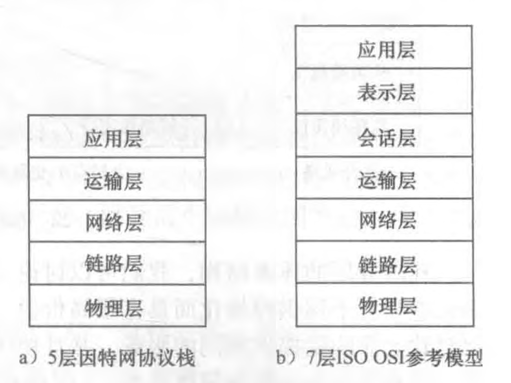
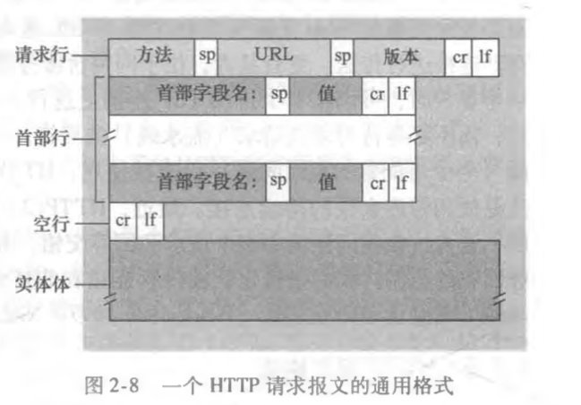

- [3. IP地址]
  - ipv6
- [4. 子网掩码及网络划分]
- [5. ARP/RARP协议]
- [6. 路由选择协议]
- [7. TCP/IP协议]
  - TCP速率控制
- [8. UDP协议　]
- [9. DNS协议]
- [10. NAT协议]
- [11. DHCP协议]
- [12. HTTP协议]
- WebSocket
- VPN
- Traceroute
- OKHttp运行原理
- 宽带认证


## 网络层次模型

OSI模型由国际标准化组织(ISO)提出，经过互联网的发展，目前大多采用五层模型或TCP/IP四层模型。层次模型总的设计理念为下层为上层服务。




1. 应用层

   应用程序实现的协议，包括常见的HTTP、FTP、SMTP（邮件传输协议）等。位于应用层的信息分组称为报文文 (message)。

2. 运输层

   接收上一层的数据，对大数据进行分割。包含了TCP和UDP协议，TCP保证了数据的可靠交付。运

   输层的分组称为报文段 (segment) 。

3. 网络层

   这层对端到端的包传输进行定义，它定义了能够标识所有结点的逻辑地址，还定义了路由实现的方式和学习的方式。为了适应最大传输单元长度小于包长度的传输介质，网络层还定义了如何将一个包分解成更小的包的分段方法。示例：IP，IPX等。在这一层，数据的单位称为数据包 (packet)。

4. 链路层

   定义了互联网络的两个设备之间传输数据的规范，并提供了顺序控制、差错检测和恢复。在这一层，数据的单位称为帧(frame)

5. 物理层

   实际的传输介质，例如，双绞铜线、单模光纤。

OSI参考模型相比5层模型多了表示层和会话层。

- 表示层

  使通信的应用程序能够解释交换数据的含义。这些服务包括数据压缩和数据 加密(它们是自解释的)以及数据描述(这使得应用程序不必担心在各台计算机中表示/ 存储的内部格式不同的问题)

- 会话层

  提供了数据交换的定界和同步功能，包括了建立检查点和恢复方案的方法


## 应用层协议

### HTTP

HTTP定义了通讯报文的结构与交换报文的方式，并使用TCP作为它的支撑运输协议。

#### 连接过程

1. 当发起连接时，客户端会先与服务端建立一个TCP连接。
2. 当连接建立成功后，客户端就会通过该TCP连接向服务端发送HTTP请求报文（HTTP报文会随着TCP的第三次握手一并发送）。
3. 服务端当从对应的TCP连接中获取到HTTP请求报文后，经过处理后返回HTTP相应报文。
4. 客户端接收到响应报文，做出相应动作。

在整个过程中，HTTP不需要关注数据丢失恢复等细节，因为数据丢失和乱序故障中恢复是在TCP中进行处理，对于HTTP只需关注自身对请求参数处理后返回响应即可。

当客户端连续快速发起两次或多次完全相同的请求，HTTP服务器不会因为之前发送过了一次响应结果而导致后续的结果有所不同，因为HTTP是一个**无状态协议**，不会去存储客户端的任何信息。

#### 连接模式

HTTP在其默认方式下使用持续连接，但也能配置成使用非持续连接。

如果在一个HTML中包含大量的图片等需二次请求的内容资源，如果使用非持续连接，在客户和服务器中都要分配TCP的缓冲区和保持TCP变量, 这给Web服务器带来了严重的负担。

> 持续连接(persistent connection) ：使用同一个TCP连接发送多个报文，当超过一定时间没有发送报文则关闭连接
>
> 非持续连接(non-persistent connection)：每发一个报文就新建一个TCP连接。


#### HTTP报文格式

HTTP请求报文格式如下：



```
GET /somedir/page.html HTTP/1.1 
Host: www.someschool.edu
Connection: close 
User-agent: Mozilla/5.0 
Accept-language: fr
```


HTTP请求报文的第一行叫作**请求行**(request line)，其后继的行叫作**请求头部**(header line)，在最后还有**请求体**。请求头有3个字段:**方法**、**URL**和**HTTP版本**。

##### 请求行

其中方法包含以下几种：

- GET: 通常用于获取资源，没有body

- POST: 增加或修改资源，有body

- PUT：修改资源，有body，*应用时大多被POST取代*

- DELETE：删除资源，没有body

- HEAD: 与GET基本相同，区别为服务器返回内容时是不会返回body，一个应用场景：下载前获取文件的大小、是否支持断点续传


而目前HTTP版本主流的是HTTP/2 在 HTTP/1.1，其中HTTP/2为2005年发布。

HTTP/2 在 HTTP/1.1 有几处基本的不同：

- HTTP/2 是二进制协议而不是文本协议。不再可读，也不可无障碍的手动创建，改善的优化技术现在可被实施。
- 这是一个复用协议。并行的请求能在同一个链接中处理，移除了 HTTP/1.x 中顺序和阻塞的约束。
- 压缩了 headers。因为 headers 在一系列请求中常常是相似的，其移除了重复和传输重复数据的成本。
- 其允许服务器在客户端缓存中填充数据，通过一个叫服务器推送的机制来提前请求。

> https://developer.mozilla.org/zh-CN/docs/Web/HTTP/Basics_of_HTTP/Evolution_of_HTTP

##### 请求头部

请求头部用来说明服务器要使用的附加信息：

- Host: 服务器的主机地址。

  因为访问时是通过DNS服务器解析出服务器的ip地址后，通过ip进行访问，当这个ip地址所对应的服务器下部署了多个域名的网站，服务器将通过Host传来的地址确定对应的具体网址。

- Connection:默认为keep-alive，即TCP连接默认不关闭，可以被多个请求复用，一段时间没有活动则关闭连接（规范的做法是，客户端在最后一个请求时，发送`Connection: close`，明确要求服务器关闭TCP连接）

- Content-Type/Content-Length : 内容的类型和长度

  - text/html：html文本
  - application/x-www-form-urlencoded：普通表单（纯文字表单）
  - multipart/form-data:多部分形式，包含二进制的内容
  - Application/json
  - Image/jpeg

- Transfer-Encoding: 分块传输，Content-Length不可用，传输结束时内容为0

- Location:重定向的位置

- User-Agent:让服务器识别设备类型

- Range/Accept-Range：使用断点续传/是否支持断点续传

- Accept:客户端能接受的数据类型

- Accept-Charset：客户端能接受的字符集

- Accept-Encoding:客户端能接受的压缩编码类型，如gzip

- Content-Encoding：传输内容的压缩类型

##### 请求体

请求报文最下边为请求体，可为空，是这次请求所附加的额外信息，在POST请求中，存放的是请求参数。


响应报文如下：


链路层交换机实现了第一层和第二层;路由 器实现了第一层到第三层


节点时延的类型

- 处理时延(nodal processing delay) ：解析包数据，判断下一跳路由、差错判断的处理时间（微秒或更低的数量级）
- 排队时延(queuing delay)：链路阻塞，等待传输 （毫秒到微秒量级）
- 传输时延 (transmission delay)：路由会在完整接收全部分组后才会进行下一跳的转发，也就是当路由接收到第一个分组开始直到完整的分组接受完成所需的时间。取决于链路的速率和包的大小。（毫秒到微秒量级）
- 传播时延(propagation delay)：包在链路上传输的所需的时间，取决于链路上的最大传输速度（毫秒量级）


运输层协议提供

1. 可靠数据传输

2. 吞吐量：确保最低速率（并没有提供）

3. 定时（并没有提供）

4. 安全性：安全套接字层(Secure Sockets Layer, SSL)

   用SSL加强后的TCP不仅能够做 传统的TCP所能做的一切，而且提供了关键的进程到进程的安全性服务，包括加密、数 据完整性和端点鉴别，SSL不是与TCP和 UDP在相同层次上的第三种因特网 运输协议，而是一种对TCP的加强，这种强化是在应用层上实现的


TCP服务模型

- 面向连接
- 可靠的数据传送


